# Praktikum Hari ke-2 - Fundamental Git
**Nama : Reni Setyaningsih**

## **1. `git init`**

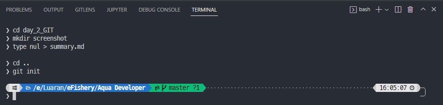

## **2. `git add`**

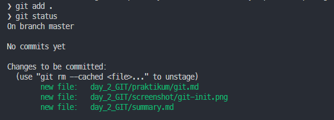

## **3. `git commit`**

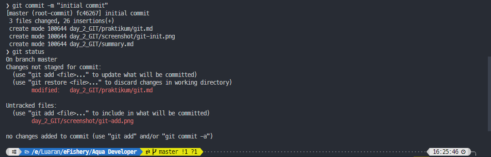

## **4. `git remote`**

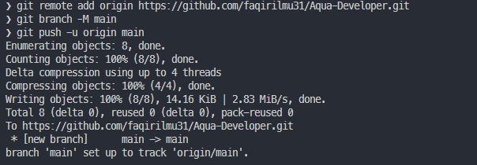

Bukti hasil remote
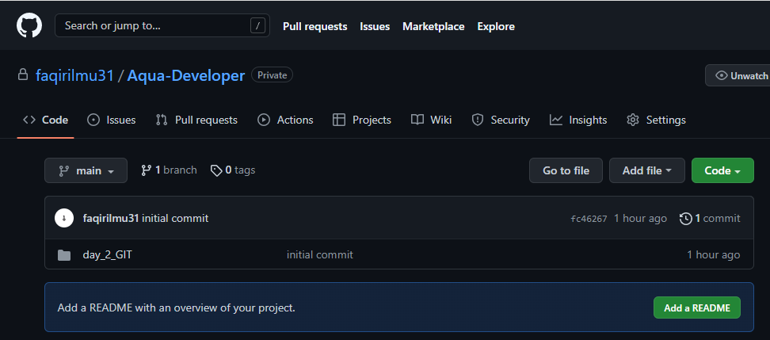

## **5. `git pull`**

file yang diupload 
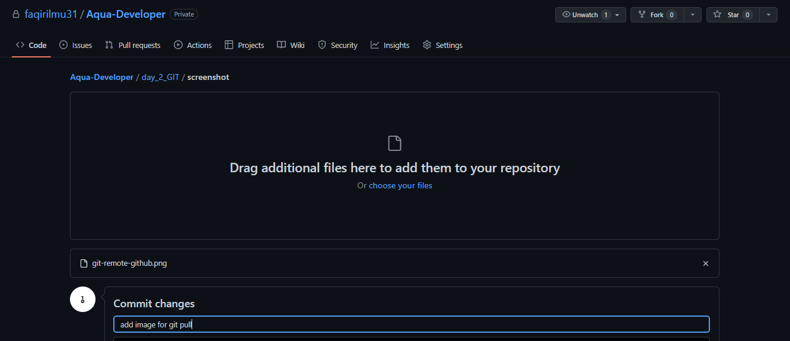
sebelum `git pull`

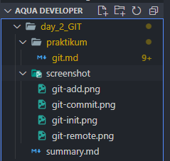

sesudah `git pull`

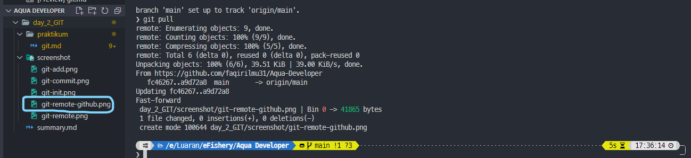

## **6. `git branch`**

sebelum `git branch`

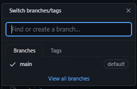

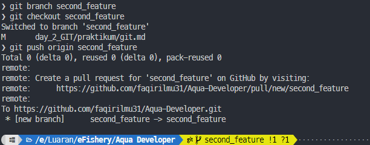

sesudah `git branch`

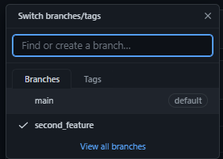

## **7. `git merge`**

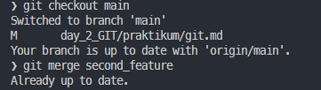

## **8. `git status`**

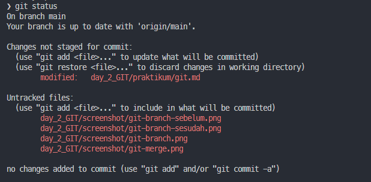

## **9. `git fetch`**

file yang ditambahkan : README.md
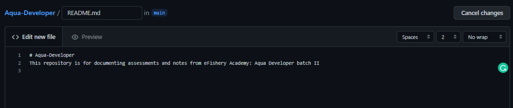

## **10. `git push`**

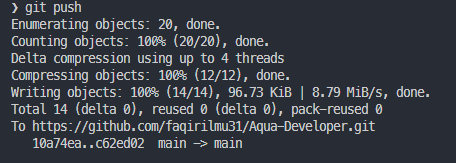
