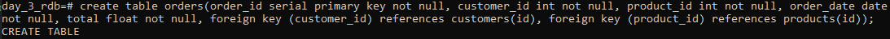

# **Praktikum Hari ke-3 - Relational Database**
**Nama : Reni Setyaningsih**

Soal : Buatlah query untuk membuat database pada halaman sebelumnya. Setelah itu buat query untuk insert, update, delete di masing-masing table. Dan terapkan join di table order.

## **CREATE DATABASE DAN TABLE**

- membuat database

  

  

- membuat tabel

  

  

  
## **INSERT**

- insert customers

  

- insert products

  

- insert orders

  

## **UPDATE**

- update customers

  

- update products

  

- update orders

  

## **DELETE**

## **JOIN**

