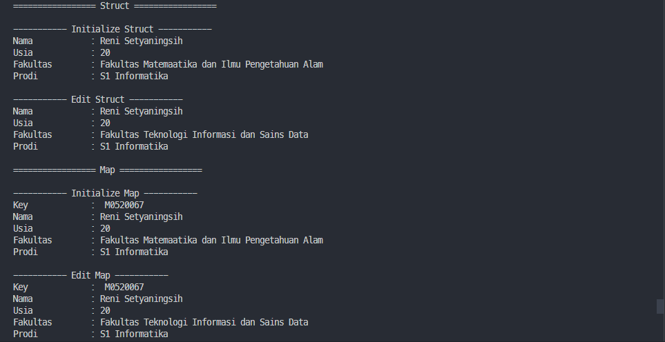
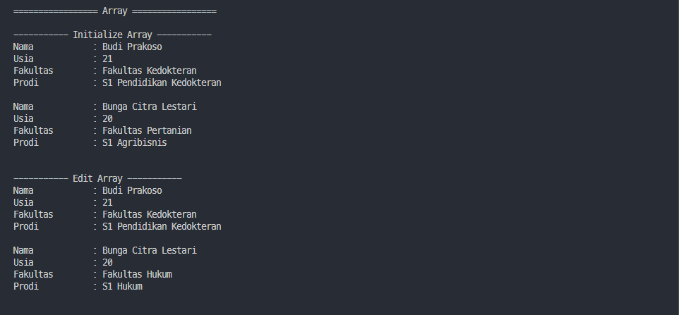
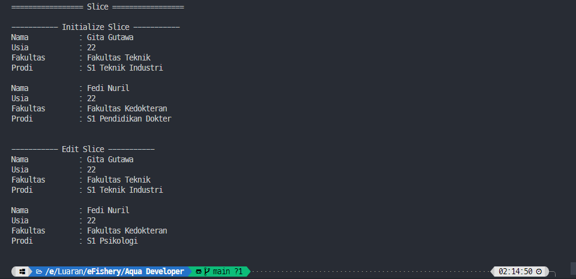

## **Praktikum Hari ke-4 - Basic Golang**
**Nama : Reni Setyaningsih**

TUGAS : Membuat deklarasi variable menggunakan struct, map, array, dan slice. Kemudian assign data menjadi data yang baru

**Hasil :**

