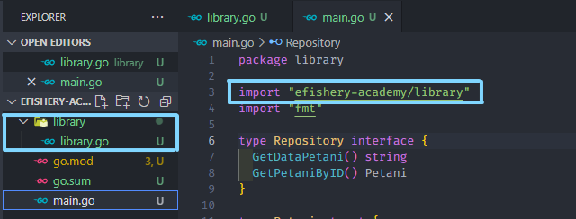
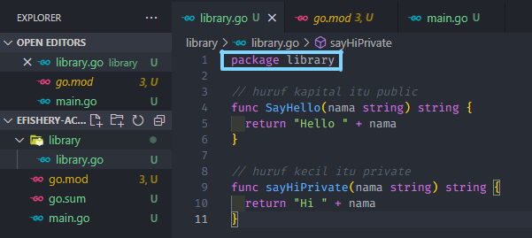

# **Ringkasan Materi #05 - Advance Golang**

## **Pointers**

Pointer adalah sebuah variable untuk menyimpan alamat memory dari variable lain. 

bertipe pointer ditandai dengan adanya tanda asterisk `(*)` tepat sebelum penulisan tipe data ketika deklarasi.

Contoh :

```
var number *int
var name *string
```

Ada dua hal penting yang perlu diketahui mengenai pointer:

- Variabel biasa bisa diambil nilai pointernya, caranya dengan menambahkan tanda ampersand (&) tepat sebelum nama variabel. Metode ini disebut dengan referencing.
- Dan sebaliknya, nilai asli variabel pointer juga bisa diambil, dengan cara menambahkan tanda asterisk (*) tepat sebelum nama variabel. Metode ini disebut dengan dereferencing.

```
var numberA int = 4
var numberB *int = &numberA

fmt.Println("numberA (value)   :", numberA)  // 4
fmt.Println("numberA (address) :", &numberA) // 0xc20800a220

fmt.Println("numberB (value)   :", *numberB) // 4
fmt.Println("numberB (address) :", numberB)  // 0xc20800a220
```


## **Method**

Method adalah fungsi yang menempel pada struct.

Contoh :

```
package main

// import "strings"
import "fmt"

type student struct {
	name string
	grade int
}

func main() {
	var student1 = student{"Reni", 10}
	student1.SayHello()
}

func (s student) SayHello() {
	fmt.Println("Hello", s.name)
}
```

**Method Pointer**
Method pointer adalah method yang variabel objek pemilik method tersebut berupa pointer.

Contoh :

```
package main

// import "strings"
import "fmt"

type student struct {
	name string
	grade int
}

func main() {
	var student1 = student{"Reni", 10}
	student1.SayHello()

	student1.changeName("Reni Setyaningsih")
	student1.SayHello()
}

func (s student) SayHello() {
	fmt.Println("Hello", s.name)
}

func (s *student) changeName(name string) {
	s.name = name
}
```

## **Public and Private Property Method**

Pada GO sebenarnya tidak ada istilah public modifier dan private modifier. Yang ada adalah exported yang kalau di bahasa lain ekuivalen dengan public modifier, dan unexported untuk private modifier.

Ketika kita ingin mengimpor dan mengekspor sebuah fungsi khusus kita dapat melakukan hal berikut :






## **Interface**

Dalam Go, interface adalah tipe kustom yang digunakan untuk menetapkan satu atau lebih method signature dan interface bersifat abstrak, jadi kita tidak diizinkan untuk membuat turunan antarmuka.

Contoh :

```
package main

import "fmt"

type HasName interface {
	GetName() string
}

func SayHello(h HasName) {
	fmt.Println("Hello", h.GetName())
}

type Person struct {
	Name string
}

func (person Person) GetName() string {
	return person.Name
}

type Animal struct {
	Name string
}

func (animal Animal) GetName() string {
	return animal.Name
}

func main() {
	var eko Person
	eko.Name = "Eko"

	SayHello(eko)

	cat := Animal{
		Name: "Kocheng",
	}
	SayHello(cat)
}
```


## **GoRoutine**

Goroutine menyupport Golang agar bisa melakukan suatu hal dengan cepat. Golang dikenal sangat efektif karena untuk menjalankan GoRoutine hanya membutuhkan 2kb memori saja. Umumnya, untuk menjalankan thread dibutuhkan 1MB atau 1000kb. Sehingga, bisa dibayangkan bahwa kita dapat menjalankan sekitas 500 thread di GoRoutine.

Contoh :

```
package main

import (
	"fmt"
	"time"
)

func numbers() {
	for i := 1; i <= 5; i++ {
		fmt.Println(i)
		time.Sleep(time.Second * 10)
	}
}

func alphabets() {
	for i := 'a'; i <= 'e'; i++ {
		fmt.Printf("%c ", i)
		time.Sleep(time.Second * 10)
	}
}

func main() {
	go numbers()
	go alphabets()
	time.Sleep(time.Second * 10)
}
```

Namun, karena kecepatannya dan yang berjalan secara concurrent, maka hasil output yang ditampilkan akan teracak dan kadang tidak tercetak. Untuk mengatasi hal ini, kita dapat menggunakan beberapa metode locking, yaitu race condition locking, sync-mutex locking, dan atomic variable locking.

- race condition locking

  ```
  package main

  import (
    "fmt"
    "sync"
  )

  var saldo int = 0

  var isLock bool = false

  func addSaldo() {
    for i := 0; i < 10000000; i++ {
      saldo++
    }
  }

  func Lock(lockedFunc func()) {
    for isLock {
      if !isLock {
        break
      }
    }

    isLock = true

    lockedFunc()

    isLock = false
  }

  func main() {
    wg := sync.WaitGroup{}

    wg.Add(2)

    go func() {
      defer wg.Done()
      Lock(addSaldo)
    }()

    go func() {
      defer wg.Done()
      Lock(addSaldo)
    }()

    wg.Wait()
    fmt.Println(saldo)
  }
  ```

- sync-mutex locking

  ```
  package main

  import (
    "fmt"
    "sync"
  )

  var saldo int = 0

  var isLock bool = false

  var lock sync.Mutex

  func addSaldo() {
    for i := 0; i < 10000000; i++ {
      saldo++
    }
  }

  func Lock(lockedFunc func()) {
    for isLock {
      if !isLock {
        break
      }
    }

    isLock = true

    lockedFunc()

    isLock = false
  }

  func main() {
    wg := sync.WaitGroup{}

    wg.Add(2)

    go func() {
      defer wg.Done()

      lock.Lock()
      addSaldo()
      lock.Unlock()
    }()

    go func() {
      defer wg.Done()
      lock.Lock()
      addSaldo()
      lock.Unlock()
    }()

    wg.Wait()
    fmt.Println(saldo)
  }
  ```

- atomic variable locking

  ```
  package main

  import (
    "fmt"
    "sync"
    "sync/atomic"
  )

  var saldo int64 = 0

  var isLock bool = false

  var lock sync.Mutex


  func addSaldo() {
    for i := 0; i < 10000000; i++ {
      atomic.AddInt64(&saldo, 1)
    }
  }

  func Lock(lockedFunc func()) {
    for isLock {
      if !isLock {
        break
      }
    }

    isLock = true

    lockedFunc()

    isLock = false
  }

  func main() {
    wg := sync.WaitGroup{}

    wg.Add(2)

    go func() {
      defer wg.Done()
      addSaldo()
    }()

    go func() {
      defer wg.Done()
      addSaldo()
    }()

    wg.Wait()
    fmt.Println(saldo)
  }
  ```
